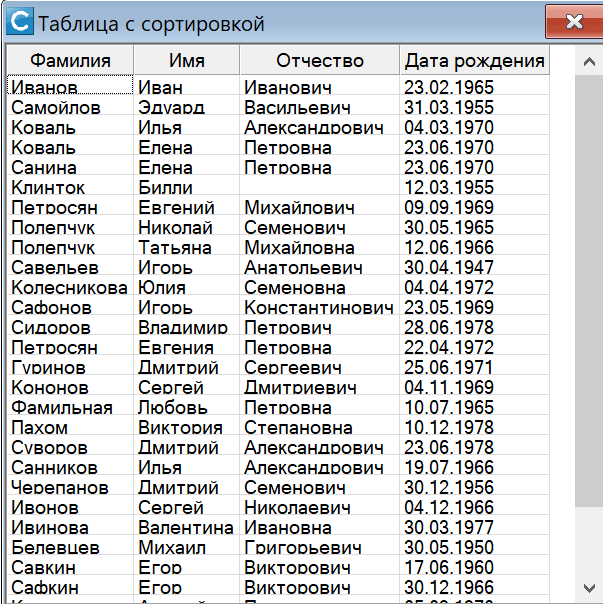

# Как сортировать данные в таблице

В этой статье рассматривается пример организации сортировки строк в таблице на форме 
с возможностью выбора направления сортировки и определения собственных правил 
упорядочивания строк.



Используются метод `Sort` и обработчик события `SortEvaluate` элемента __TableControl__.

Работа рассмотренного примера проверена на демо-версии ИСУБД "CronosPro" 7.0, 
скачанной с [официального сайта](http://www.cronos.ru).

### Исходные данные

Предположим у нас есть форма, на которой размещена таблица `table1` (элемент __TableControl__). 
В этой таблице будем выводить список записей из базы Лицо (ФИО и дату рождения).

```lua
function Форма_Load( form, event )

--	Начальные установки для таблицы
	Me.table1.NumberRows = 1
	Me.table1.NumberCols = 4
	
	Me.table1:SetCellText(0,-1,"Фамилия")
	Me.table1:SetCellText(1,-1,"Имя")
	Me.table1:SetCellText(2,-1,"Отчество")
	Me.table1:SetCellText(3,-1,"Дата рождения")

--	заполняем таблицу
	filltable()
end

function filltable()

--	заполнение таблицы записями базы Лицо
	local base = GetBank():GetBase("ЛЦ")
	local rs = base.RecordSet
	Me.table1.NumberRows = rs.Count
	local row = 0
	for rec in rs.Records do
		Me.table1:SetCellText(0,row,rec:GetValue(2))
		Me.table1:SetCellText(1,row,rec:GetValue(3))
		Me.table1:SetCellText(2,row,rec:GetValue(4))
		Me.table1:SetCellText(3,row,rec:GetValue(9))
		row = row + 1
	end
	Me.table1:BestFit(0,3)
end

```

### Добавляем возможность сортировки
Разрешим пользователю сортировать данные щелчком по заголовку столбца. 
Для этого добавим в модуль формы обрабочик события `CellClick`.

```
function table1_CellClick( event )
	if event.RowIndex == -1 then
		Me.table1:Sort(event.ColumnIndex)
	end	
end
```

Свойства `RowIndex` и `ColumnIndex` переданого обработчику объекта event содержат номер строки 
и столбца ячейки, на которой произведен щелчок. Если пользователь щелкнул по строке заголовка 
(номер строки равен -1), вызываем метод `Sort`, который упорядочивает строки по значениям 
соответствующего столбца.

Пока сортировка по любому столбцу производится с параметрами по умолчанию, т.е. данные 
сортируются как строки и только по возрастанию. 


### Меняем направление сортировки

Чтобы учитывать направление сортировки нам придется для каждого столбца запоминать, 
отсортирован ли он сейчас и  если да, то в каком направлении. Для хранения этой информации 
будем использовать дополнительную строку в заголовке. 

Добавим в блок "Начальные установки для таблицы" обработчика `Форма_Load` команды 
для формирования в заголовке второй строки. 

```lua
	...
	Me.table1.TopHdrRows = 2
	Me.table1.TopHdrHeight = 22	
	Me.table1:SetRowHeight(-2,0)
	Me.table1:SetRowHeight(-1,22)
```

Теперь заголовок содержит две строки. В первой (с индексом -1) по-прежнему выводятся 
названия полей. Вторая (с индексом -2) имеет нулевую высоту, т.е. не видна пользователю. 
В ней будем записывать признак сортировки для конкретного столбца:

- `a` - столбец отсорирован по возрастанию
- `d` - по убыванию
- `пусто` - столбец не отсортирован.


Модифицируем также обработчик события `CellClick` таблицы:

```lua
function table1_CellClick( event )
	if event.RowIndex == -1 then
		if Me.table1:GetCellText(event.ColumnIndex,-2) == "a" then
			for i=1,4 do
				Me.table1:SetCellText(i-1,-2,"")
			end
			Me.table1:SetCellText(event.ColumnIndex,-2,"d")
			Me.table1:Sort(event.ColumnIndex,TableControl.SortDescending)
		else	
			for i=1,4 do
				Me.table1:SetCellText(i-1,-2,"")
			end
			Me.table1:SetCellText(event.ColumnIndex,-2,"a")
			Me.table1:Sort(event.ColumnIndex,TableControl.SortAscending)
		end
		
	end
end
```
Теперь при щелчке по заголовку мы проверяем значение в дополнительной строке. 
Если там записано _a_ (т.е. сейчас столбец отсортирован по возрастанию), 
сортируем данные по убыванию, в противном случае - по возрастанию. 

В том столбце, по которому произведен щелчок, записываем соответствующий признак, 
в остальных столбцах признак сортировки сбрасываем.

### Сортируем по своим правилам

Добьемся, чтобы столбец с датами рождения сортировался по правилам сравнения дат, а не строк.
Для этого добавим в модуль формы функцию-обработчик события `SortEvaluate` таблицы:

```lua
function OnSortEvaluate( event )
	local a,b
	if event.ColumnIndex == 3 then
		a, b = event.Data1, event.Data2
		a = event.Data1:gsub("^(%d%d)%.(%d%d)%.(%d+)","%2-%1-%3")
		b = event.Data2:gsub("^(%d%d)%.(%d%d)%.(%d+)","%2-%1-%3")
		event.Handled = true
		if a > b then 
			return = 1	
		elseif a < b then
			return = -1
		else
			return = 0
		end	
	else 
		return 0
	end
end
```

В процессе работы метода `Sort` данный обработчик будет вызываться многократно - 
для каждой пары сраниваемых значений. Свойства `Data1` и `Data2` объекта `event` 
содержат значения сравниваемых ячеек, а свойство ColumnIndex - номер столбца, 
по которому осуществляется сортировка.

В приведенном выше примере мы преобразуем строки из формата _ДД.ММ.ГГГГ_ 
к формату _ММ-ДД-ГГГГ_, после чего сравниваем их как обычные строки, 
т.е. сортируем лиц по дню рождения (от 1 января к 31 декабря) без учета года.

Добавим в `Форма_Load` строчку, связывающую событие SortEvaluate с нашим обработчиком ...

```lua
...
--	определяем обработчик события сравнения значений при сортировке
	Me.table1.SortEvaluate = OnSortEvaluate
```
... и можно играться.

## Дополнительные материалы

Форму для банка Primer1, в которой реализован рассмотренный пример 
и текст ее модуля можно [скачать здесь](https://github.com/sinilga/cronospro/tree/master/assets/sources/tablesort). 
