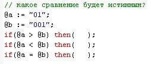

Тема этого поста навеяна опросом, который предложил один из участников телеграмм-чата [CronosProChat](https://t.me/CronosProChat/4986):

  
*Источник: https://t.me/CronosProChat/4986*

Эксперименты, проведенные в ИСУБД CronosPro 7.0 демо,  показали, что в данной задаче ни один из предложенных вариантов сравнения не дает истину. Формула:
```lua
@a:="01"
@b:="001"
if (@a < @b) then [ @r(-1):=@a << " < " << @b ]
if (@a > @b) then [ @r(-1):=@a << " > " << @b ]
if (@a = @b) then [ @r(-1):=@a << " = " << @b ]
@ret := catval(@r, @endofline)
```

Выдает пустой результат.

Вот так! С точки зрения Cronos эти два значения не являются равными, и при этом ни одно из них не больше другого.

Вместе с тем истинными являются выражения: `@a # @b`, `@a <= @b` и `@a >= @b`:

Формула:
```lua
@a:="01"
@b:="001"

if (@a # @b) then [ @r(-1):=@a << " # " << @b ]
if (@a <= @b) then [ @r(-1):=@a << " <= " << @b ]
if (@a >= @b) then [ @r(-1):=@a << " >= " << @b ]

@ret:=catval(@r,@endofline)
```

возвращает:
```
01 # 001
01 <= 001
01 >= 001
```

Возникает закономерный вопрос: как в этих условиях выполняется сортировка массива, содержащего подобные строки.

Пробуем выполнить:
```lua
@c(1):="000000001"
@c(2):="0001"
@c(3):="01"
@c(4):="000001"
@c(5):="001"

@ret:=catval(@c,";")<<" --> "<<catval(sort(@c,1,0),";")
```
и получаем строки, отсортированные в лексикографическом порядке:
```
000000001;0001;01;000001;001 --> 000000001;000001;0001;001;01
```

Итак, можно сделать предположение, что в операциях сравнения "**меньше**", "**больше**", "**меньше или равно**" 
и "**больше или равно**" строки, которые могут быть приведены к числовому типу, сравниваются как числа. 
А в операциях "**равно**", "**неравно**", а также в функции **SORT** - как строки.

**Вывод**

Безопаснее всего следить за типом данных самостоятельно и выполнять приведение типов явно:
- если нужно сравнить значения как числа, пишем   
`if @a+0 < @b+0 then ...`    
или    
`if (@a - @b) < 0 then ...`

- если как строки - `if "_" << @a < "_" << @b then ...`


А лучше - вообще избегать подобных ситуаций, например не использовать в словарях коды с лидирующими нулями (вида "001").
