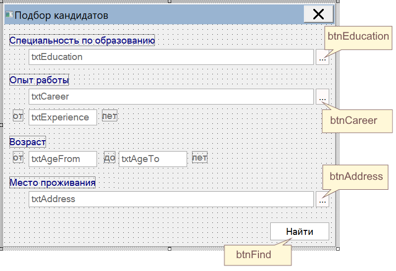

Начинаем серию статей, в которой рассмотрим поэтапно создание в демо-банке 
"Primer" управляющей формы для отбора кандидатов по заданным критериям.

На примере этой формы продемонстрируем возможности управляющих форм и скриптов 
по созданию элементов интерфейса, контролю вводимых пользователем данных, 
созданию собственных диалоговых окон и взаимодействию с ними основной формы, 
и, конечно, по формированию запросов и отбору записей из банка данных. 

## Начало
Итак, обрисуем задачу. Мы собираемся создать форму, которая позволяла 
бы отбирать кандидатов по направлению полученного ими образования, опыту работы 
на конкретных должностях, общему стажу работы в этих должностях, возрасту 
кандидата и месту его проживания.

Для начала нам необходимо создать саму форму  разместить на ней нужные 
элементы управления.

Общий вид формы приведен на рисунке. Названия текстовых полей (TextBox) показаны 
прямо на соответствующем элементе, названия кнопок (PictureButton) - в выносках.
Названия надписей (Label) сейчас не важны, так как мы не будем обращаться 
к ним в коде.



Поля `txtEducation` и `txtCareer` предназначены для записи поисковых ограничений на 
направление образования  и занимаемые должности. 
Чтобы работающему с нашей формой коллеге не приходилось угадывать, 
какие варианты есть в банке, предложим выбирать их из списков, 
которые будем формировать на основе записей в базах "Образование" 
и "Трудовая деятельность". 

Аналогичным образом в поле `txtAddress` будем формировать перечень поисковых 
ограничений на место проживания кандидата. 

В полях `txtExperience`, `txtAgeFrom` и `txtAgeTo` разрешим записывать ограничения на 
стаж работы в выбранных должностях, минимально и максимально приемлемый 
возраст кандидата. Формат значения - целое положительное число.

## Настройки окна

Позаботимся о том, чтобы наша форма аккуратно выглядела в любой ситуации.
Печально было бы видеть развернутую на весь экран форму, в углу которой 
сиротливо жмутся элементы ввода.


Постараемся не допустить такого. В первую очередь запретим разворачивать окно 
и растягивать границу. Для этого в свойствах формы установим тип границы - 
"Окно диалога", в пункте "Кнопка размера" выберем вариант "Свертывания".

Также необходимо установить значение "Да" в свойстве "Всплывающее". 
В противном случае состояние окна нашей формы будет влиять на все открытые 
в Cronos окна: при активировании нашей формы они все будут переходить 
от развернутого или свернутого состояния в нормальное.

Наконец, отключим полосы прокрутки и установим свойство "Центрировать".


 
## Наводим лоск

Итак, теперь наша форма выглядит достаточно прилично, но все же
чего-то не хватает, а именно - визуальной границы между областью условий 
и кнопкой "Найти".

К сожалению, Кронос не позволяет рисовать на форме произвольные фигуры, 
но горизонтальную линию можно имитировать с помощью панели высотой в 1 пиксель.

Чтобы не рисовать эту панель вручную, просто добавим с модуль формы 
функцию Line, которая выполнит всю работу за нас.

```lua
function Line(name, y)
	local line = Panel(name,"",0,y,Me.Width,1)
	line.Transparent = false
	line.BackColor = Color.ControlDark
	line.TabStop = false
	Me:AddControl(line)
end
```

В функцию `Line` передаются в качестве параметров имя будущего элемента 
(каждый элемент формы должен иметь уникальное имя) и вертикальную координату 
для размещения панели.

Функция выполняет следующие действия:
- создает в точке с координатами (0,y) объект класса **Panel** с заданным именем, 
шириной, равной ширине формы, и высотой 1;
- делает панель непрозрачной;
- окрашивает ее цветом **ControlDark** из системной палитры;
- отключает возможность остановки на этой панели при обходе элементов 
формы клавишей Tab;
- и, наконец, размещает созданный элемент на форме.

А теперь разместим вызов функии `Line` в обработчике события `Load` формы.

```lua
function Форма_Load( form, event )
	Line("edge",Me.btnFind.Y - 15)
end
```

Таким образом мы создаем линию с именем `edge` на расстоянии 15px выше кнопки "Найти".

## Поиск

Научим нашу форму искать хоть что-нибудь в банке. Создадим функцию `MakeRequest`, 
которая должна будет сформировать строчный запрос по заданным условиям, 
и обработчик события `Click` для кнопки "Найти", который выполнит этот запрос 
и отобразит результаты.

```lua
function btnFind_Click( control, event )
	local req, err = MakeRequest()
	if req then
		local rs = GetBank():StringRequest(req)
		if not rs then 
			MsgBox("При выполнении запроса произошла ошибка\r\n"..req)
		elseif rs.Count == 0 then
			MsgBox("Подходящих записей не найдено")
		else
		--	отображение найденных записей
			GetBank():GetBase("ЛЦ"):OpenReview(rs)
			Me.WindowState = Form.Minimized
		end
	else
		MsgBox(err)
	end
end

function MakeRequest()
	local req = "ОТ ЛЦ01"
	return req
end
```

Пока полезной работы наша форма выполняет немного: отбирает все записи 
из базы "Лицо", отображает их в стандартном окне коррекции и сворачивается.

Далее по мере совершенствования формы мы будем добавлять в функцию `MakeRequest`
новые условия отбора.
