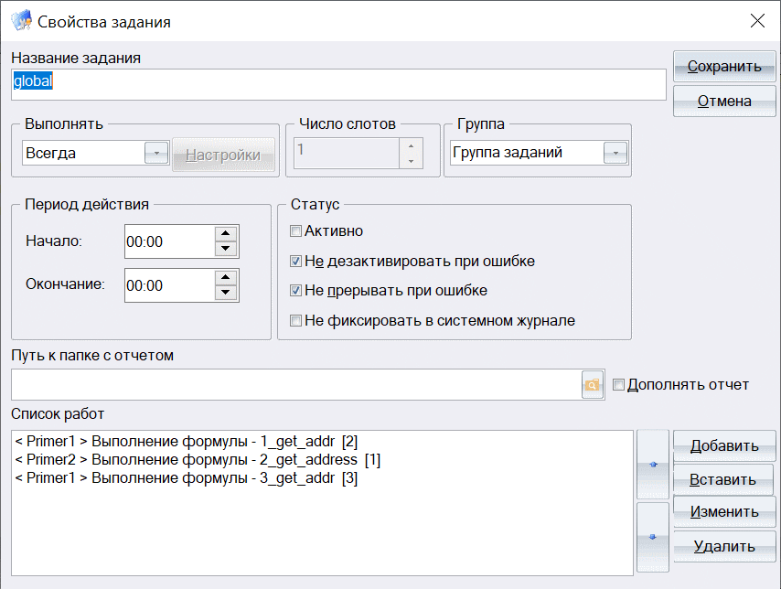

Время от времени на различных площадках, посвященных обсуждению вопросов 
использования ИСУБД CronosPro задается вопрос о возможности из формулы 
или скрипта одного банка обратиться к данным другого. В этой статье описывается 
один вариант решения этой задачи, использующий возможности планировщика 
заданий ИСУБД Cronos и суперглобальные переменные.

> Данный способ был проверен в демо-версии ИСУБД CronosPro 7.0

**Планировщик** - инструмент, позволяющий сформировать в ИСУБД ***задание***, в включив 
в него несколько ***работ***. В состав работ может входить выполнение формулы 
выходных форм, но самое примечательное, что работы в рамках одного задания 
могут относиться к разным банкам. А значит, ничто не мешает создать в различных 
банках формулы, совместно выполняющие некоторую последовательность действий, и 
последовательно запустить их на выполнение в рамках одного задания планировщика.

**Суперглобальные переменные** - специальные объекты, создаваемые формулами 
в оперативной памяти. Они существует с момента своего создания и до завершения 
текущего сеанса ИСУБД, причем доступ к значению такой переменной может получить 
любая формула, выполняемая в этом сеансе. Таким образом, суперглобальные 
переменные - инструмент, который позвоит формулам разных банков передавать 
результаты своей работы друг-другу.


## Постановка задачи
Для определенности будем рассматривать два пробных банка, которые 
предоставляет Кронос-Информ на своем сайте: Primer - банк кадрового агентства 
и Primer2 - поставки и поставщики.

Предположим, что работая с банком Primer мы хотим считывать из банка Primer2 
информацию об организациях (база "Поставщики").

Конкретизируем задачу: необходимо отобрать в банке Primer организации без адресов, пробить их по банку Primer2 и дописать адреса, если они есть.

В качестве упрощения будем полагать, то наименования организаций в обоих банках написаны единообразно, являются уникальными и позволяют однозначно отличить одну организацию от другой.

Также для простоты мы не будем парсить полученные из банка Primer2 адреса (которые там записаны в одну строку), а просто будем создавать в банке Primer связанную с организацией запись АД и записывать всю информацию в поле "Улица". 

## Описание решения

Решение нашей задачи заключается в последовательном выполнении трех формул в банках Primer и Primer2:

№|Primer | Primer2
-|-|-
1|Отбираем организации без адреса и формируем перечень их системных номеров и наименований|
2| | Считываем сформированный на предыдущем шаге перечень наименований РГ, проверяем каждую по базе "Поставщики", дописываем адрес. 
3|Считываем полученный перечень, создаем связанные с РГ записи АД, записываем в них информацию |

Далее приведен листинг соответствующих формул. 

### Шаг 1. Формируем список наименований организаций

```perl
@rg_list:=""
@rs:=find("ОТ РГ01 100 КРАТ РВ 0 АД02 АД02")
@i:=1; @n:=valcount(@rs)
while (@i <= @n) do [
	viewrecord(РГ{@rs(@i)},
		@rg_list(@i,1):=@sysnomer
		@rg_list(@i,2):=РГ1
	)	
	@i:=@i+1
]

setglobal("rg_list",@rg_list)
@ret:=@formuladone
```

Здесь мы отбираем организации, не имеющие связанных записей "Адрес", 
и формируем в переменной `@rg_list` двумерный массив со строками вида 
(системный_номер, наименование_РГ). 

### Шаг 2. Проверка в банке Primer2
```perl
@rg_list:=getglobal("rg_list")	

@i:=1; @n:=valcount(@rg_list)
while (@i <= @n) do [
	@req:="ОТ ПС01 1 РВ `" << @rg_list(@i,2) << "`"
	@rs:=find(@req)
	if @rs then [
		viewrecord(ПС{@rs[1]},
			@rg_list(@i,3):=ПС2
		)	
	]
	@i:=@i+1
]

setglobal("rg_list",@rg_list)
@ret:=@formuladone
```
Здесь мы считываем сформированный массив в переменную `@rg_list`, для каждой строки формируем и выполняем строчный запрос на отбор организации по наименованию и, если такая организация существует, дописываем в массив третьим столбцом ее адрес. Результат снова помещаем в суперглобальную 
переменную `rg_list`.

### Шаг 3. Обработка результатов в банке Primer

```perl
@rg_list:=getglobal("rg_list")	
@i:=1; @n:=valcount(@rg_list)
while (@i <= @n) do [
	if @rg_list(@i,3) then [
		@sn:=@rg_list(@i,1)
		userecord(РГ{@sn},
			@ad:=NEW(РГ100_АД)
			userecord(АД{@ad},
				АД4:=@rg_list(@i,3)
			)
		)
	]
	@i:=@i+1
]
setglobal("rg_list","")
@ret:=@formuladone
```
Вновь считываем массив из суперглобальной переменной, проходим по его строкам и, если в строке присутствует адрес (третий элемент), для записи РГ с системным номером, соответствующим первому элементу строки, создаем новую связанную запись "Адрес".

### Формирование задания планировщика

Ну и в заключение нам необходимо создать задание планировщика, включив в него последовательно три описанные выше формулы.



Чтобы проверить работу нужно добавить в базу "Поставшики" банка Primer2 записи с наименованиями организаций, для которых в банке Primer нет адресов (ТОО Глобус, Сфинкс-банк, ...)
