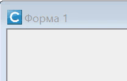
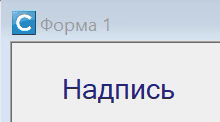
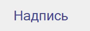

В этой статье рассматривается способ создания на форме элементов оформления в виде мигающих или мерцающих надписей.

## Мигающая надпись



Для начала заставим какую-либо надпись форме мигать, т.е. исчезать и появляться с определенной периодичностью.

Основным инструментом решения данной задачи будет связанный с формой таймер (объект класса **Timer**), который позволяет организовать выполнение некоторых действий через заданные интервалы времени. В нашем случае для создания эффекта мигающей надписи функция-обработчик таймера должна будет включать и выключать свойство `Visible` надписи. 

Итак, код функции, которая включает эффект мигания для переданного ей в качестве параметра элемента управления:

```lua
function flashing(control)
	timer = Me:CreateTimer(function()
		timer:Stop()
		control.Visible = not control.Visible
		timer:Start()
	end, 500)
	timer:Start()
end	
```

Первый параметр метода `CreateTimer` - функция-обработчик, которая будет вызываться при каждом срабатывании таймера. Как и было задумано, она просто изменяет значение свойства `Visible` на противоположное.

Первая команда обработчика `timer:Stop()` приостанавливает таймер на время работы функции, а последняя (`timer:Start()`) - запускает его снова. Это нужно, чтобы предотвратить срабатывание таймера в момент, когда предыдущий цикл обработки еще не завершен. 

Конечно, в данном случае можно было бы обойтись и без них, ведь время выполнения единственной команды (`control.Visible = not control.Visible`) явно меньше, чем интервал срабатывания таймера (500 мс). Но я предпочитаю добавлять эти команды во все обработчики таймера. На всякий случай.

Еще один момент, на который следует обратить внимание: переменная `timer`, в которой сохраняется ссылка на созданный объект, должна быть глобальной. В противном случае к ней нельзя будет обратиться в теле функции-обработчика.

Теперь чтобы сделать какую-либо надпись формы мигающей достаточно вызвать эту функцию, передав ей ссылку на нужный элемент **Label**:

```lua
	flashing(Me.label1)
```

Чтобы выключить мигание следует остановить и удалить таймер:

```lua
	timer:Stop()
	timer:delete()
```

## Мерцающая надпись



Немного усложним задачу и заставим надпись не просто исчезать и появляться, а плавно затухать и проявляться на форме, т.е. изменять свой цвет от основного (установленного свойством `ForeColor` при создании надписи) до фонового.

Первым делом нам понадобиться вспомогательная функция, умеющая смешивать два цвета в определенной пропорции:
```lua
function color_mix(fore,back,k)
	local r = fore.R*k + back.R*(1-k)
	local g = fore.G*k + back.G*(1-k)
	local b = fore.B*k + back.B*(1-k)
	return Color.new(r,g,b)
end
```
Первые два параметра (объекты класса **Color**) задают смешиваемые цвета, а третий (вещественное число в диапазоне от 0 до 1) - нужные пропорции. При *k=1* результирующий цвет совпадает с `fore`, а при *k=0* - с `back`.

А теперь - функция, реализующая эффект мерцания:

```lua
function blinking(control)
	local color_mix = function(fore,back,k)
		local r = fore.R*k + back.R*(1-k)
		local g = fore.G*k + back.G*(1-k)
		local b = fore.B*k + back.B*(1-k)
		return Color.new(r,g,b)
	end

	local fore, back = control.ForeColor, control.Parent.BackColor
	local X, delta = 0, 0.05
	timer = Me:CreateTimer(function()
		timer:Stop()
		X = X + delta
		local K = math.abs(math.fmod(X,2)-1)
		control.ForeColor = color_mix(fore,back,K)
		timer:Start()
	end, 50,Timer.start)
end	
```

Здесь мы используем все тот же прием с таймером. Исходный цвет надписи и к фона фиксируются в переменных `fore` и `back` вне тела функции-обработчика. В качестве цвета фона мы используем свойство `BackColor` родительского элемента, так как сама надпись, как правило имеет прозрачный фон.

Для задания пропорций смешивания цветов мы используем функцию , где X пробегает значения от нуля до бесконечности с шагом 0,05.

В результате *K* последовательно получает значения 1; 0,95; ... 0.05; 0; 0,05; ...; 0,95; 1; ....

> Чтобы сделать мерцание боле плавным, можно использовать функцию: , которая обеспечит замедление изменения цвета при приближении к точкам минимальной и максимальной яркости.  
> 

