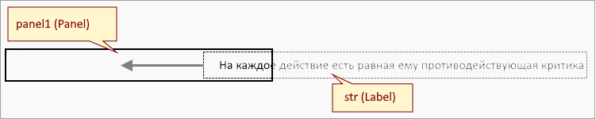

В продолжение темы, начатой в [предыдущей статье](/flashing/), где мы рассмотрели создание на форме мигающих надписей, сегодня предлагаю рассмотреть создание еще одного элемента оформления - бегущей строки.
<center>
<video width="185" height="64" autoplay loop poster="../assets/img/2022-03-08-marquee/screen.png">
<source src="../assets/img/2022-03-08-marquee/marquee.mp4" type="video/mp4"  />
</video>
</center>

Как и в прошлый раз анимацию будет обеспечивать связанный с формой таймер, а роль самой бегущей строки будет играть надпись (*Label*). Функция обработчик таймера должна будет изменять значение свойства `X` надписи, создавая эффект движения. 

Для создания эффекта отсечения части строки, мы поместим надпись внутрь панели, которая станет выполнять функцию окна прокрутки: часть надписи, находящаяся в пределах панели будет видна на форме, а остальная часть - скрыта.

{: align="center"}

Движение надписи должно начинаться от правой границы панели и заканчиваться, когда вся надпись окажется левее панели, после чего цикл повторяется. 

Листинг функции, создающей бегущую строку:

```lua
local function CreateMarquee(frame, text)
	local str = Label.new("str",text,frame.Width,0)
	str.FontSize = 14
	str:AdjustMinSize()
	frame:AddControl(str)
	
	local start, finish = frame.Width, -str.Width
	local delta = 2	
	timer = Me:CreateTimer(function()
		timer:Stop()
		str.X = str.X - delta
		if str.X < finish then
			str.X = start
		end
		timer:Start()
	end, 1)
	timer:Start()
end
```

Первым параметром в функцию должна передаваться ссылка на панель, внутри которой  будет прокручиваться содержимое, второй параметр - отображаемый текст. 

```lua
CreateMarquee(Me.panel1,"На каждое действие есть равная ему противодействующая критика")
```

Скорость движения текста можно регулировать изменяя в функции `CreateMarquee` интервал срабатывания таймера и величину смещения `delta`.
